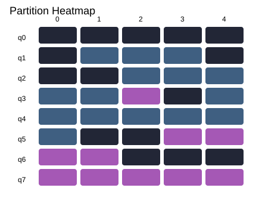
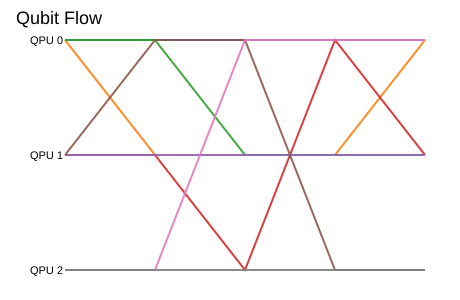
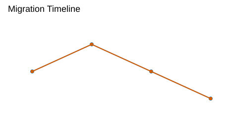
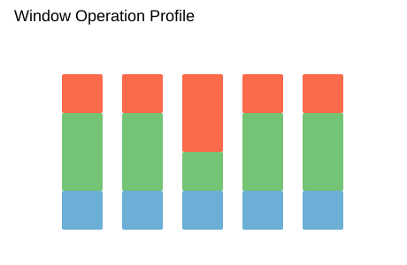

# memQ Distributed Quantum Compiler (memQ-DQC)


<p align="center">
    <a href="https://github.com/memQGit/DistributedCompiler/actions/workflows/ci.yml">
        
    </a>
    <a href="https://github.com/memQGit/DistributedCompiler/blob/main/LICENSE">
      
    </a>
</p>

memQ-DQC is an open-source distributed quantum compiler designed to optimize and compile quantum circuits for execution on distributed quantum computing architectures.

---

This repository uses **Ruff** for linting and formatting and **pytest** for tests. All checks are wrapped in a single script for convenience.

### Run all checks

To run all checks locally (lint, format check, and tests):

    uv run tox

### Run checks individually

If you want to run each step on its own:

#### Linting (Ruff)

    uv run ruff check .

#### Formatting check (Ruff)

Checks formatting without modifying files:

    uv run ruff format --check .

To automatically format files instead:

    uv run ruff format .

#### Tests (pytest)

    uv run pytest -q

## Visualization helpers

The package includes plotting helpers for partition schedules and migration
behavior:

- `plot_partition_heatmap(...)`: qubit-vs-window assignment heatmap.
- `plot_migration_timeline(...)`: moved-qubit counts per transition.
- `plot_qubit_flow(...)`: trajectory-style qubit flow across windows.
- `plot_window_operation_profile(...)`: stacked operation mix
  (1Q/local-2Q/remote-2Q) per window.

Example:

```python
from memq_dqc.visualization import (
    plot_partition_heatmap,
    plot_qubit_flow,
    plot_window_operation_profile,
)

plot_partition_heatmap(partitioner.schedule, sort_by_final_qpu=True)
plot_qubit_flow(partitioner.schedule, max_qubits=16)
plot_window_operation_profile(partitioner.schedule, partitioner.windows)
```


### Visualization gallery

You can preview representative outputs in `examples/visualizations/`:

- Heatmap

  

- Qubit flow

  

- Migration timeline

  

- Window operation profile

  

To regenerate these artifacts:

```bash
python examples/visualizations/generate_example_svgs.py
```
